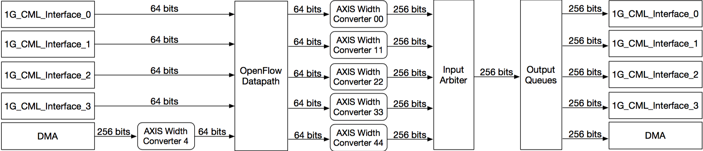

This is an OpenFlow switch for NetFPGA 1G CML.
To build it, place the 'openflow_switch_1g_cml' directory under "$(NF_ROOT)/contraib-projects" and run 'make' in the directory.

This project was implemented by 'reference_nic_1g_cml' and 'openflow_datapath_v1_00_a'.
It includes Xilinx CAM (xapp1151) in the 'openflow_switch_1g_cml/hw/pcores/openflow_datapath_v1_00_a'

c.f. You should turn off 'TCP checksum offload'

-Reference
https://docs.google.com/document/d/1ZwHXQZocKwQls6Ted8VZO8h9MjBtu9WxV2fAY44eOgE/edit

-Structure

